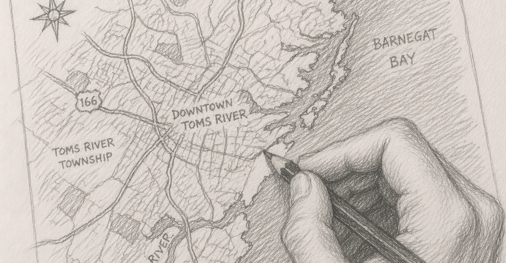

# Housing Affordability in Toms River, NJ



This repository documents an in-progress geospatial analysis project focused on housing affordability in Toms River, New Jersey.

The goal is to estimate how much income remains after the full cost of homeownership is considered - not just mortgage payments, but also property taxes, flood-related risk, insurance, and other location-sensitive housing costs. The project is being built at the parcel level so that affordability can be studied spatially rather than only through townwide or countywide averages.

At its current stage, the repository contains the early mapping and data-integration work needed to support that larger affordability model.

## What the project does right now
- loads Ocean County parcel geometry for Toms River Township
- joins selected MOD-IV property assessment attributes to parcel boundaries
- clips FEMA flood-hazard polygons to the Toms River study area
- downloads, merges, and clips DEM elevation raster data for the local area
- identifies parcels intersecting mapped FEMA flood-hazard zones
- computes parcel-level elevation statistics from the DEM
- exports an interactive Folium map showing flood zones and flood-intersecting parcels

## Why this project exists

Housing affordability is often discussed in terms of sale prices or mortgage payments alone. That misses a major part of the real burden on households, especially in coastal communities like Toms River where flood exposure, insurance costs, taxes, and parcel-level variation matter.

This project is an attempt to build a more realistic affordability framework by combining geospatial, tax, hazard, and insurance-related data into one workflow.

## Current repository contents

- `tr_parcel_map.py`  
  Reads Toms River parcel geometry and MOD-IV assessment records from an Ocean County geodatabase, joins parcel and tax data, and exports an interactive Folium parcel map.

- `tr_flood_map.py`  
  Reads FEMA flood-hazard polygons, clips them to the Toms River township footprint using parcel geometry, filters to mapped hazard zones, and exports an interactive Folium flood map.

- `fema_ins.py`  
  Pulls FEMA NFIP policy records for the Toms River area for downstream flood-insurance analysis.

- `home_ins.py`  
  Pulls and cleans homeowners-insurance-related data for selected Toms River ZIP codes.

- `mls.py`  
  Early local database and workflow testing for storing and organizing project data.

## Tech stack

- Python
- Pandas
- GeoPandas
- Folium
- PostgreSQL
- FEMA / public hazard data
- Parcel and tax assessment data
- Planned machine learning workflows for insurance-cost estimation

## Project direction

The longer-term objective is to build a parcel-level affordability model that can answer questions such as:

- How much income remains after major housing costs are paid?
- How does affordability vary across neighborhoods and flood zones?
- Where do taxes and insurance materially change the affordability picture?
- How different is the affordability story when flood risk is included?

## Next steps

- Add elevation and terrain data for parcel-level flood-risk context
- Join parcel and hazard layers to insurance datasets
- Build a PostgreSQL-backed spatial data pipeline
- Estimate flood-insurance costs where direct premium data is missing
- Add census tract and block group context
- Develop an interactive Dash dashboard for exploration and comparison

- ## Data Used So Far

- Ocean County parcel geodatabase
- Ocean County MOD-IV assessment data
- FEMA flood-hazard polygons
- USGS / 3DEP DEM elevation raster data

## Status

This project is under active development. The current code should be understood as the spatial and data-engineering foundation for a larger affordability and risk-analysis workflow, not a finished dashboard or finished model.


## Repository Structure

```text 
housing-affordability-toms-river/
├── README.md
├── field-notes/
│   ├── project-log.md
│   ├── data-sources.md
│   └── methodology.md
├── images/
│   └── tr_pic.png
├── src/
│   ├── tr_parcel_map.py
│   ├── tr_flood_map.py
│   └── tr_parcels_flood_elev.py
└── outputs/

